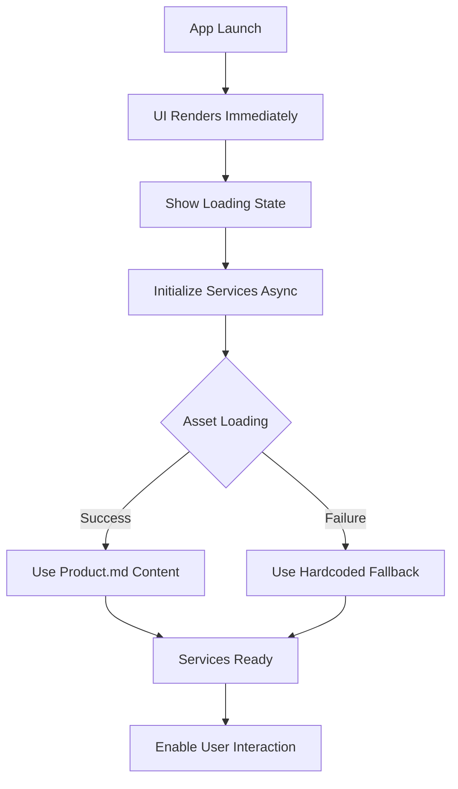

# Design Document: App Crash Fix

## Overview

This design addresses the black screen crash issue in the Nethra Bengaluru Superapp by implementing comprehensive error handling, proper asset management, and defensive programming practices. The solution ensures the app starts reliably regardless of asset availability while maintaining full functionality.

## Architecture

The fix involves three main architectural changes:

1. **Defensive Asset Loading**: Wrap all asset loading operations in try-catch blocks with fallback mechanisms
2. **Lazy Service Initialization**: Decouple UI rendering from service initialization to prevent blocking
3. **Graceful Degradation**: Ensure core functionality works even when optional components fail



## Components and Interfaces

### AILogic Service (Enhanced)

**Current Issues:**
- Synchronous asset loading blocks initialization
- No error handling for missing assets
- Single point of failure

**Enhanced Design:**
```dart
class AILogic {
  static String? _systemInstruction;
  static bool _isInitialized = false;
  
  // Async initialization with error handling
  static Future<void> initialize() async {
    try {
      _systemInstruction = await _loadSystemInstruction();
      _isInitialized = true;
    } catch (e) {
      debugPrint("AILogic initialization error: $e");
      _systemInstruction = _getFallbackInstruction();
      _isInitialized = true;
    }
  }
  
  // Safe asset loading with fallback
  static Future<String> _loadSystemInstruction() async {
    try {
      return await rootBundle.loadString('assets/product.md');
    } catch (e) {
      debugPrint("Error loading product.md: $e");
      return _getFallbackInstruction();
    }
  }
  
  // Comprehensive fallback instruction
  static String _getFallbackInstruction() {
    return '''
    [Complete hardcoded system instruction with all Bengaluru rules]
    ''';
  }
}
```

### Main App (Enhanced)

**Current Issues:**
- No loading state during initialization
- Services block UI rendering
- No error recovery mechanisms

**Enhanced Design:**
```dart
class _ChatScreenState extends State<ChatScreen> {
  bool _isInitializing = true;
  String? _initializationError;
  
  @override
  void initState() {
    super.initState();
    _initializeApp();
  }
  
  Future<void> _initializeApp() async {
    try {
      await AILogic.initialize();
      await _voiceService.initialize();
      setState(() {
        _isInitializing = false;
      });
    } catch (e) {
      setState(() {
        _initializationError = e.toString();
        _isInitializing = false;
      });
    }
  }
  
  @override
  Widget build(BuildContext context) {
    if (_isInitializing) {
      return _buildLoadingScreen();
    }
    
    if (_initializationError != null) {
      return _buildErrorScreen();
    }
    
    return _buildMainInterface();
  }
}
```

## Data Models

### Initialization State

```dart
enum InitializationState {
  loading,
  ready,
  error,
}

class AppState {
  final InitializationState state;
  final String? errorMessage;
  final bool servicesReady;
  
  const AppState({
    required this.state,
    this.errorMessage,
    this.servicesReady = false,
  });
}
```

## Asset Management Strategy

### Current Problem
- `.kiro/product.md` is not properly bundled as a Flutter asset
- Hidden directories (`.kiro`) can cause build issues on Android
- Asset path format is incorrect for Flutter

### Solution
1. **Move Asset**: Relocate `product.md` to `assets/product.md`
2. **Update pubspec.yaml**: Add asset declaration
3. **Fix Asset Path**: Use proper Flutter asset path format

```yaml
# pubspec.yaml
flutter:
  assets:
    - assets/product.md
```

```dart
// Correct asset loading
await rootBundle.loadString('assets/product.md');
```

## Error Handling Strategy

### Layered Error Handling

1. **Asset Level**: Try-catch around rootBundle.loadString
2. **Service Level**: Try-catch around service initialization
3. **UI Level**: Error states and retry mechanisms
4. **Application Level**: Global error boundaries

### Error Recovery Mechanisms

```dart
class ErrorRecovery {
  static Future<T> withFallback<T>(
    Future<T> Function() primary,
    T Function() fallback,
  ) async {
    try {
      return await primary();
    } catch (e) {
      debugPrint("Primary operation failed: $e");
      return fallback();
    }
  }
}
```

## Loading States Design

### Normal Mode Loading
- Glassmorphic container with gradient
- Animated progress indicator
- "Initializing Nethra..." text
- Smooth transitions

### Blind Mode Loading
- High contrast yellow on dark background
- Large, clear text
- Screen reader announcements
- Tactile feedback ready

```dart
Widget _buildLoadingScreen(bool isBlindMode) {
  if (isBlindMode) {
    return _buildHighContrastLoading();
  }
  return _buildStyledLoading();
}
```

## Correctness Properties

*A property is a characteristic or behavior that should hold true across all valid executions of a system-essentially, a formal statement about what the system should do. Properties serve as the bridge between human-readable specifications and machine-verifiable correctness guarantees.*

### Property Reflection

After analyzing the acceptance criteria, several properties can be consolidated:
- Properties 1.1, 1.2, 1.3 can be combined into a comprehensive asset loading failure property
- Properties 2.1, 2.2, 2.3 can be combined into an initialization state management property
- Properties 4.1, 4.2, 4.3, 4.4, 4.5 can be combined into a comprehensive error handling property

### Core Properties

**Property 1: Asset Loading Resilience**
*For any* asset loading operation that fails, the system should catch the error, log it for debugging, use the hardcoded fallback instruction, and continue initialization successfully
**Validates: Requirements 1.1, 1.2, 1.3**

**Property 2: Fallback Instruction Completeness**
*For any* fallback system instruction, it should contain all essential Bengaluru guide elements including "Namma Guide" identity, local slang, rain protocol, traffic protocol, and food recommendations
**Validates: Requirements 1.4**

**Property 3: Functional Equivalence**
*For any* user query and context, responses generated using fallback instructions should be functionally equivalent to responses using asset-loaded instructions
**Validates: Requirements 1.5**

**Property 4: Initialization State Management**
*For any* app startup sequence, the system should display loading indicators during initialization, prevent interaction with uninitialized components, and transition to the main interface upon completion
**Validates: Requirements 2.1, 2.2, 2.3**

**Property 5: Error State Handling**
*For any* initialization failure, the system should display an error message, provide retry mechanisms, and maintain accessibility in both normal and blind modes
**Validates: Requirements 2.4, 2.5**

**Property 6: Asset Path Correctness**
*For any* asset loading code, the path format should follow Flutter conventions using 'assets/' prefix
**Validates: Requirements 3.4**

**Property 7: Asset Accessibility**
*For any* properly bundled asset, it should be accessible via rootBundle.loadString without throwing exceptions
**Validates: Requirements 3.5**

**Property 8: Comprehensive Error Handling**
*For any* service initialization exception, the system should catch it gracefully, provide meaningful error messages, offer retry mechanisms, preserve core functionality, and log sufficient debugging information
**Validates: Requirements 4.1, 4.2, 4.3, 4.4, 4.5**

**Property 9: UI State Indicators**
*For any* pending operation, the UI should show appropriate loading indicators and enable interactions only when services are ready
**Validates: Requirements 5.2, 5.3**

**Property 10: Accessibility Compliance**
*For any* loading state in blind mode, the UI should have proper accessibility attributes for screen reader announcement
**Validates: Requirements 5.5**

## Testing Strategy

### Dual Testing Approach

This implementation will use both unit tests and property-based tests to ensure comprehensive coverage:

**Unit Tests** will focus on:
- Specific error scenarios (missing assets, network failures)
- UI state transitions (loading → ready → error)
- Asset path format validation
- Accessibility attribute verification

**Property-Based Tests** will focus on:
- Asset loading resilience across various failure modes
- Functional equivalence between fallback and asset-loaded instructions
- Error handling across different exception types
- UI state management across various initialization sequences

### Property-Based Testing Configuration

Using the `test` package with custom property generators:
- Minimum 100 iterations per property test
- Each test tagged with: **Feature: app-crash-fix, Property {number}: {property_text}**
- Custom generators for:
  - Asset loading failure scenarios
  - User queries and contexts
  - Service initialization exceptions
  - UI state transitions

### Test Implementation Strategy

1. **Mock Asset Loading**: Create controllable asset loading that can simulate failures
2. **State Verification**: Verify UI states and service states at each step
3. **Error Injection**: Systematically inject errors to test resilience
4. **Accessibility Testing**: Verify screen reader compatibility in blind mode
5. **Performance Boundaries**: Ensure initialization doesn't block UI rendering

The testing strategy ensures that the app remains crash-proof under all conditions while maintaining full functionality and accessibility compliance.